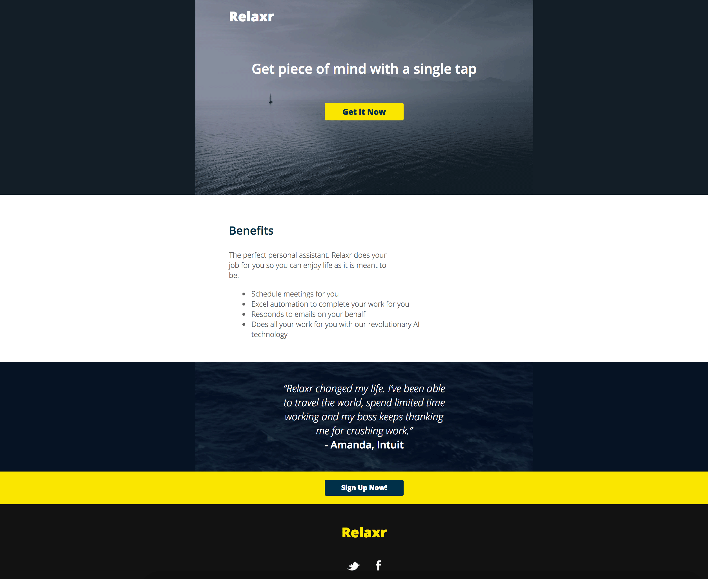
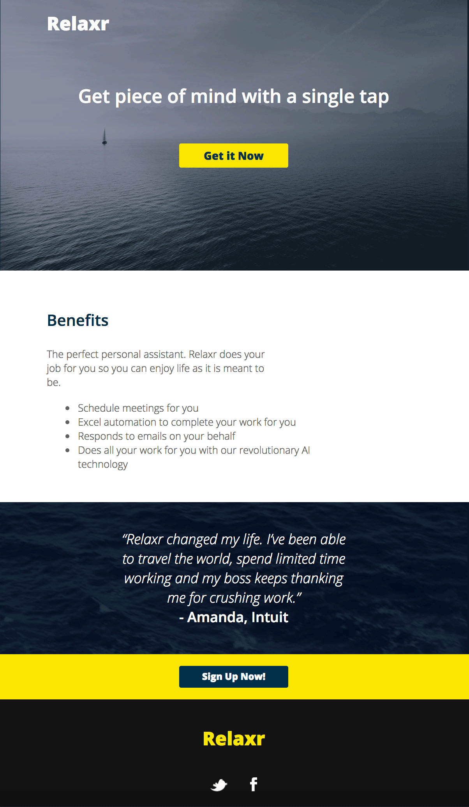

# Build a Layout for Relaxr

> Students will fork this repository and clone it. Upon completion, push (sync/publish) all of your changes after committing them.

## Reading from [Learn HTML & CSS](http://learn.shayhowe.com/html-css)

- [Chapter 4: Opening the Box Model](http://learn.shayhowe.com/html-css/opening-the-box-model/)
- [Chapter 5: Opening the Box Model](http://learn.shayhowe.com/html-css/positioning-content/)

### Description

A hot, new NY Tech Startup, Relaxr, has approached you to help them develop a new landing page for their company. They've handed you the [design file](starter_code/design_file.txt) for the site, along with the copy and assets. You need to take these files and turn it into a landing page.

*Note: For a view of the full page, see the [jpg](starter_code/images/relaxr_landing.jpg) provided in the deliverable. Don't be alarmed if your font sizes don't perfectly match what you see in the jpg - trust in the design file!*

#### Small Screen & Widescreen Views

> Remember to use a wrapper id/class to set a content width

### Real-World Applications

- Build a website from a [design file](starter_code/design_file.txt)
- Integrate advanced CSS properties
- Use HTML5 structural elements (section, nav, aside, ...)
- Use CSS Resets to "normalize" the rendering of your page across different browsers (normalize.css)
- Use the Box Model to style element borders and structure your page

### Technical Requirements

- Use HTML5 structural elements (nav, header, footer - please as few divs as possible)
- Use a CSS Reset file in addition to your style.css file to style the page (normalize.css)
- Use IDs and Classes to to select and style elements on the page
- Style your text with the Google Fonts provided by your style guide. Google fonts provides the CSS you need to change fonts.
- Follow naming conventions, maintain consistency across .html and .css files and use best practices for naming IDs and Classes
- Indent nested elements to increase your code's readability

### Resources

- Starter code can be found inside of the "starter_code" folder for this assignment.
- [Box Model explanation from Mozilla](https://developer.mozilla.org/en-US/docs/Web/CSS/box_model)
- [Box Model Breakdown](http://learn.shayhowe.com/html-css/opening-the-box-model/)
- [CSS Tricks difference between IDs and Classes](https://css-tricks.com/the-difference-between-id-and-class/)
- [What is a CSS Reset?](http://www.cssreset.com/what-is-a-css-reset/)
- Relaxr's [design file](starter_code/design_file)
